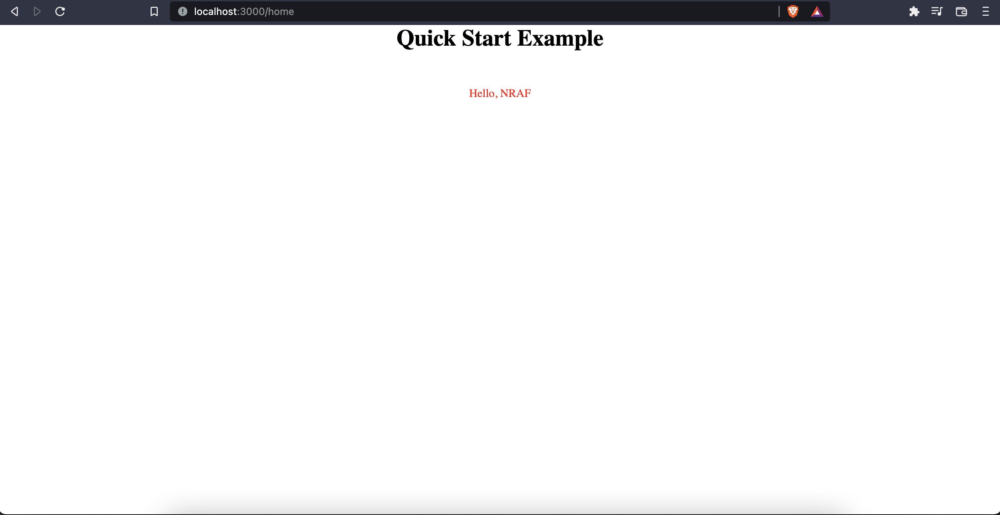

# Quick Start Guide

Start by create a new directly somwhere on your machine. For the sake of this tutorial, I am gonna call it `nraf-quick-start`, if you wanna do the same, you can use the command.

```bash
mkdir nraf-quick-start
```

## Installation

We will move into the directory we just created, you can using

```bash
cd nraf-quick-start
```

Once, we are at the exact location, first step is to initalize a new `npm` project. To do that, type

```bash
npm init -y
```

This will create a `package.json` file inside your directory, after which, we can install the `NRAF` package. To do that, type

```bash
npm install @nraf/core
```

And that's it, we have downloaded all the necessary things, we need for your to follow along with this guide.

## Project Setup

Start by creating a `index.js` file in the root of your project, that's sufficient for creating REST APIs, but if you are making a website which also serves some static assets and/or web pages, you need to create two more directories / folders. You can call them whatever, but a good standard is to use the names `views` and `public`.

So, we are going to use those, and we can easily create all those things using, the one liner below.

```bash
mkdir views && mkdir public && touch index.js
```

We will be keeping all our statis assets in the `public` directory, so things like `css`, `javascipt`, `images`, etc go in there.

We will use the `views` directory to write out templates, NRAF out of the box ships with it's own templating engine, which you can read more about [here](./template-engine.md).

And that's all you will need in terms of project structure.

**NOTE**

> NRAF isn't strict about any directory names or places where you need to place things, etc. All things are configurable and you can choose from the simplest to the most complex project structures, whatever suits your needs better 🚀🚀🚀.

## Application Entrypoint

We will use the `index.js` file as our application entrypoint. Start by pasting the code below in the `index.js` file we just created.

```js
const NRAF = require("@nraf/core");

const app = NRAF();
const PORT = process.env.PORT || 3000;

app.get("/", (req, res) => {
  res.send("Hello World");
});

app.listen(PORT, () => {
  console.log("Server is running on PORT: ", PORT);
});
```

We start by importing `NRAF` from the `@nraf/core` package, which we installed at the beinging of this guide.

`NRAF` is an app constructor, which we call and create an object of, which we store in a variable called `app`. You can call this anything, we call it `app`, as it's sortof a standard.

We create a variable called `PORT`, which will be used to hold the port value, our application will run on.

When the use out first method from `NRAF`, called `get`.
You can read more about the `get` method [here](./core-api.md).

We will create a `GET` endpoint, using the `app.get` method, which take the a [RESOURCE URL](https://restfulapi.net/resource-naming/) as the first argument, and a callback function as the second argument.

The callback is passed two objects, `req` and `res`, which allow us to read data which the user send along with the request and send them some data as a response.

You can read more about all the available methods, etc in the core documentation.

For our first endpoint, we get a request and send back the user / client, a string `"Hello World"`, using the `res.send` method.

The default `CONTENT-TYPE` header for `NRAF` responses is `text/html`, with a status code of `200`. But, you can override both of those things using methods like `res.setStatus` and `res.setHeader`.

And when you want to send `JSON` data to the user, you can directly use `res.json` method and pass it a `Javascript` object. It takes care of serialization and setting up the all the appropriate headers internally.

After that, we use the `app.listen` method, pass it the PORT. This method is responsible for actually creating a `http` server.

And that's all the code we need.

## Running your app

Running our app now is trivial, we just need to execute the `index.js` file, with node.

```bash
node index.js
```

You must see the following output in the terminal:


View the website at: `http://localhost:3000`

You will see the Hello World text on the page:


## Adding our first view

`NRAF` out of the box, comes with it's own template engine(written from scratch). This allows developers to build dynamic web pages with ease.

Let's start by creating a few files.

Create a new `home.nraf` file inside the `views` directory, that we previously created. The file extension is important here, and `NRAF` won't recognize files, if you use any other extension.

```html
<!DOCTYPE html>
<html lang="en">
  <head>
    <meta charset="UTF-8" />
    <meta http-equiv="X-UA-Compatible" content="IE=edge" />
    <meta name="viewport" content="width=device-width, initial-scale=1.0" />
    <title>Quick Start Example</title>
    <link rel="stylesheet" href="/main.css" />
  </head>
  <body>
    <main class="container">
      <h1>Quick Start Example</h1>
      <p class="greet">Hello, {{ greet }}</p>
    </main>
  </body>
</html>
```

This is just `HTML` for most part, except the `{{ greet }}` part, which we will explain in a minute, but before that, let's create the `main.css` file which out template uses.

Inside the public directory, create a `main.css` file and add the code below.

```css
* {
  margin: 0;
  padding: 0;
}

.container {
  display: flex;
  flex-direction: column;
  gap: 50px;
  justify-content: center;
  align-items: center;
}

.greet {
  color: red;
}
```

Nothing fancy, just some flex box stuff.

Now, let's get back to `{{ greet }}`.

This is part of the `NRAF Template Langauge`, and basically means, whatever is the value of the greet varible, replace this with that value.

But, where will we get this `greet` variable from ??, we will get to that in just one second.

You can read more about the `NTE` [here](./template-engine.md).

Now, the only thing that remains is to update our `index.js` file with the code below.

```js
const { join } = require("path");
const NRAF = require("@nraf/core");

const app = NRAF();
const PORT = process.env.PORT || 3000;

app.set("views", join(__dirname, "views"));
app.set("public", join(__dirname, "public"));

app.get("/", (req, res) => {
  res.send("Hello World");
});

app.get("/home", (req, res) => {
  const greet = req.query.greet || "NRAF";
  res.render("home", { greet });
});

app.listen(PORT, () => {
  console.log("Server is running on PORT: ", PORT);
});
```

Most things we already know, so lets start from the top and look at the ones we don't know yet.

First we add a new import, where we take the `join` function, from the NodeJS `path` module, which comes out the box with Node.

Next, we encounter `app.set` method.

```js
app.set("views", join(__dirname, "views"));
app.set("public", join(__dirname, "public"));
```

These two lines are required and our app won't work as expected without these.

In `NRAF`, you have to explicitly tell where the views(/templates) and public assets exist. To do that, we use the `app.set` method.

If you are curious of why is it API like this, you can read this [blog](https://github.com/vipulbhj/vipulbhj/blob/main/blogs/LearningsWhileBuildingNRAF/TheCuriousCaseOfResDotRender/README.md).

Next, we create a new `GET` endpoint.

```js
app.get("/home", (req, res) => {
  const greet = req.query.greet || "NRAF";
  res.render("home", { greet });
});
```

We already know about `app.get`, the new buit here is `req.query.greet`. The `req` object, passed to the callback method has few useful properties, one of which is `req.query` which allows us to access the [query parameters](https://rapidapi.com/blog/api-glossary/parameters/query/), the users send with the request.

Here, we create a variable called `greet` and assign it the value of the `greet` query parameter, accessed with `req.query.greet`, and if we don't get a value, we fall back to the string "NRAF".

We, then use the `res.render` method, which takes the name of the view / template, we want to render and a object, which will be used to feed values in the template, which also answers the questions, of where does the `greet` variable come from in the

We, then use the `res.render` method, which takes the name of the view / template, we want to render and a object, which will be used to feed values in the template, which also answers the questions, of where does the `greet` value used in the templates, comes from.

And that's about it. Let's start our server again.

```bash
node index.js
```

And go to `http://localhost:3000/home`, you should see this.



And, if you add the query parameter, you should see a different greeting, the one you passed in as the parameter.

For example, `http://localhost:3000/home?greet=World` should look like


You can find all the code related to this quick start guide [here](https://github.com/vipulbhj/nraf/tree/master/examples/QuickStart)

**_Help us improve this guide, send a PR or open a issue is something is wrong, incorrect, or broken._**
